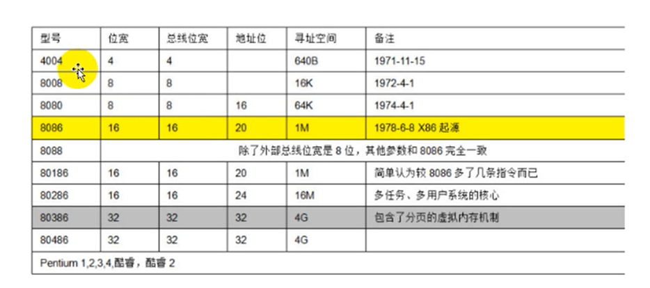

## 环境配置

```
bcdedit
bcdedit /copy {current} /d debug
bcdedit /displayorder {6ebe99f0-cf67-11eb-99ea-000c2915a63a} /addlast
bcdedit /dbgsettings SERIAL DEBUGPORT:1 BAUDRATE:115200
bcdedit /bootdebug {6ebe99f0-cf67-11eb-99ea-000c2915a63a} ON
bcdedit /debug {6ebe99f0-cf67-11eb-99ea-000c2915a63a} ON
bcdedit /timeout 30
090f876d-0a19-11eb-91ce-f2d2a66b6220


//虚拟机配置

"C:\Program Files (x86)\Windows Kits\8.1\Debuggers\x86\windbg.exe" -y SRV*C:\symbol*http://msdl.microsoft.com/download/symbols -b -k com:port=//./pipe/com_1,baud=115200,pipe

环境变量配置
_NT_SYMBOL_PATH
SRV*C:\symbol* https://msdl.microsoft.com/download/symbols


关闭KPIT(熔断_补丁)
[HKEY_LOCAL_MACHINE\SYSTEM\CurrentControlSet\Control\Session Manager\Memory Management]
 
"FeatureSettingsOverrideMask"=dword:00000003
 
"FeatureSettingsOverride"=dword:00000003
```


win + R 再通过msconfig工具查看

win + R winver查看win版本

`ld *` 命令加载全部模块符号

cpu两种架构：

risc 精简指令集 定长  2K

cisc 复杂指令集 变长 解析opcode 4K

