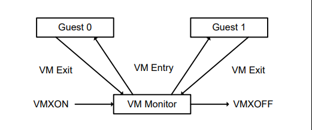

# 虚拟化(Intel)

## Intel VM架构

虚拟化扩展定义在IA-32处理器上虚拟机的处理器级别的支持，支持两类主要的软件：

虚拟机监视器VMM：作为host,完全控制处理器和其他应用程序的平台硬件，为guest software提供了虚拟机的抽象并允许它直接在逻辑处理器上执行。VMM能够保留对处理器资源、物理内存、中断管理和I/O的选择性控制

Guest software：每个虚拟机都是一个支持栈式操作系统的guest software环境，每个操作都独立于其他的虚拟机并且使用相同的处理器、内存、存储设备、图形和I/O。软件堆栈的行为就像它在没有VMM的平台上运行一样。在虚拟机中执行的软件必须以较低的权限运行，以便VMM可以保留对平台资源的控制

## VMX操作简介

处理器通过提供一种称为VMX操作的处理器操作支持虚拟化。这里有两种VMX操作：VMX root操作和VMX non-root操作，通常来说，VMM会运行在一个VMX root操作中，guest Software会运行在non-root操作里。在VMX root操作和non-root操作之间的切换被称作VMX transition。有两种VMX transition，切换进VMX non-root的操作被称作VM entry，从VMX non-root切换进VMX的操作叫VM exits.

处理器在VMX root中的操作就跟在VMX外面的操作一样多。主要的区别就在于多了一些新的指令（VMX指令），并且可以加载到某些控制寄存器中的值是有限的。

VMX非根操作中的处理器行为受到限制和修改，以便于虚拟化。某些指令（包括新的VMCALL指令）和事件会导致VM退出VMM，而不是正常操作。由于这些VM出口取代了普通行为，VMX非根操作中的软件功能受到限制。正是这种限制允许VMM保留对处理器资源的控制。

没有软件可见位能设置CPU是否处于VMX non-root opeartion状态。可让VMM阻止guest software确定它正在虚拟机中运行。

因为VMX操作甚至对使用当前特权级别（CPL）0运行的软件也有限制，所以来宾软件可以在其最初设计的特权级别上运行。此功能可以简化VMM的开发

## VMM软件的生命周期

下图说明了VMM软件的生命周期以及和它的guest software之间的交互。

软件进入VMX operation 通过执行VMXON指令。

VMM可以使用VM entries让guest进入虚拟机中（一次只能一个）。VMM使用VMLAUNCH和VMRESUME指令控制VM entry，它使用VM exits重新获得控制

VM exits将传输控制退出到VMM指定的入口点。VMM可以根据VM exit的原因采取适当的操作，，然后可以使用VM entry返回虚拟机。

最终，VMM可能会决定自行关闭并让退出VMX。它通过执行VMXOFF指令来实现。

## VM 控制结构（VMCS）

VMX non-root operation和VMX转换都是被一个叫虚拟机控制结构(VMCS)的数据结构控制的。

对VMCS的访问通过一个名为VMCS指针(每一个逻辑cpu一个)的处理器状态组件进行管理。VMCS指针的值是一个64位的VMCS的地址。这个VMCS指针使用VMPTRST和VMPTRLD指令读和写。VMM使用VMREAD、VMWRITE和VMCLEAR指令配置VMCS。

一个VMM可以为每一个它支持的虚拟机使用一个不同的VMCS，对于有多个逻辑cpu的虚拟机，VMM可以为每个虚拟cpu使用不同的VMCS。

## 探测CPU对VMS的支持

在进入VMX操作之前，必须检查CPU是否支持VMX，系统可以通过CPUID指令检测处理器是否支持VMX操作。如果CPUID.1:ECX.VMX[bit5] = 1，说明支持VMX operation。

VMX架构的设计是可扩展的，因此之后处理器可以支持第一代VMX体系结构中不存在的附加功能。使用一组VMX功能MSR寄存器向软件报告可扩展VMX功能的可用性。

## 启用并进入VMX操作

在进入VMX operation之前，需要启用VMX通过设置CR4.VMXE[bit 13] = 1。通过执行VMXON指令能进入VMX operation。如果CR4.VMXE = 0, VMXON会产生一个非法指令的异常(#UD)。一旦在VMX操作里，就不允许清除CR4.VMXE位。只用通过执行VMXOFF后系统离开VMX operation后，CR4.VMXE才能被清除。

VMXON也被IA32_FEATURE_CONTROL MSR (MSR address 3AH)控制。 当逻辑CPU被重置后，这个MSR被清除为0。这个MSR的相关位如下：

位0是lock位：如果这个bit被清除了，VMXON会产生一个generation-protection的异常。

位1是在SMX操作里启用VMXON：如果这个位被清除了，在SMX操作里执行VMXON会产生一个generation-protection的异常。如果不同时支持VMX和SMX，在逻辑cpu中设置这个位会产生一个generation-protection的异常。

位2在SMX之外气筒VMXON：如果这个位被清除了。在SMX外面执行VMXON操作会产生一个generation-protection的异常。尝试设置这个位在不支持VMX的处理器上会产生一个generation-protection的异常。

注意：如果自上次执行GETSEC[SENTER]以来GETSEC[SEXIT]尚未执行，则逻辑处理器处于SMX操作状态。如果GETSEC[SENTER]尚未执行，或者GETSEC[SEXIT]是在GETSEC[SENTER]最后一次执行之后执行的，则逻辑处理器在SMX操作之外

在执行VMXON之前，软件应该分配自然对齐的4KB内存空间用于支持一个逻辑处理器的VMX操作。这个被叫做VMXON region 这个VMXON region的地址（VMXON指针）在VMXON的操作数提供。

## 对VMX操作的限制

VMX操作对处理器操作进行了限制。细节如下：

1.在VMX操作中，处理器可能会将CR0和CR4中的某些位固定为特定值，而不支持其他值。如果这些位中的任何一位包含不受支持的值，则VMXON将失败。在VMX操作（包括VMX根操作）时，如果使用任何CLTS、LMSW或MOV CR指令，试图将其中一位设置为不受支持的值，将产生 general-protection异常。VM entry或VM exit无法将这些位中的任何一位设置为不受支持的值。软件应参考VMX功能MSR IA32_VMX_CR0_FIXED0和IA32_VMX_CR0_FIXED1，以确定CR0中的位是如何固定的。对于CR4，软件应参考VMX能力MSR IA32_VMX_CR4_FIXED0和IA32_VMX_CR4_FIXED1

注意：第一个支持VMX操作的处理器需要将以下的位设置为1在VMX操作中：CR0.PE, CR0.NE, CR0.PG, CR0.VMXE, 这个对CR0.PE和CR0.PG的限制意味着VMX操作只在分页保护模式下被支持。所以guest software不能在未分页保护模式或者实地址模式下运行。

“在guest software环境中支持处理器操作模式”，讨论VMM如何支持预期在未分页保护模式或实地址模式下运行的guest software。

后来的处理器支持名为““unrestricted guest”的VM执行控制。如果该控制位为1，则CR0.PE和CR0.PG也许是0 在VMX non-root 操作中,（即使MSR IA32_VMX_CR0_FIXED0报告的功能不同）此类处理器允许guest software在未分页保护模式或实地址模式下运行。

2.如果一个逻辑处理器在A20M模式下VMXON会失败，一旦这个处理器在VMX操作下，A20M中断会被阻塞，因此，它是不可能的在A20M模式下进入VMX操作。

3.INIT 信号会被阻塞，不管何时一个逻辑处理器在VMX的root操作下，不会被阻塞在VMX non-root下。相反，INITs会造成VM exits

4.只有当IA32_VMX_MISC[14]被读为1时，Intel 处理器的Trace（Intel PT)也可以被用于VMX操作。在处理器上支持Intel PT，但是在VMX操作中不允许使用，VMXON的执行会清除 IA32_RTIT_CTL.TraceEn；当在VMX操作中，任何的尝试写 IA32_RTIT_CTL都会造成protection exception